# Data Analysis Dashboard Project 
## Project Title 
Jumia Product Performance Dashboard: Analyzing Pricing, Discounts, and Customer Reviews 
## Project Objective 
The objective of this project is to design and build an interactive Excel dashboard that analyzes 
the performance of products listed on Jumia. Students will explore how pricing, discounts, 
reviews, and ratings influence product performance and customer engagement. The final 
dashboard should support data-driven decision-making in an e-commerce context. 
## Dataset Overview 
The dataset contains product-level data with the following columns:  
Product – Name of the product  
Current Price – Current selling price in Kenyan Shillings (KSh)  
Old Price – Original price before discount in Kenyan Shillings (KSh)  
Discount – Discount percentage applied to the product  
Reviews – Number of customer reviews  
Rating – Average customer rating out of 5 
### Data Cleaning and Preparation 
• Check for and handle missing values, especially in the Reviews and Rating columns 
• Identify and remove duplicate product entries  
• Convert price columns into numeric format by removing “KSh” (use split text to columns 
under Data tab), commas, and text or use Find and Replace (Ctrl + H)  
• Ensure the Discount column is numeric and properly formatted as a percentage (use Find and 
Replace, LEFT/RIGHT functions, or Text to Columns)  
• Convert the Rating column from text format (e.g., “4.5 out of 5”) into numeric values  
• Convert negative reviews to positive 
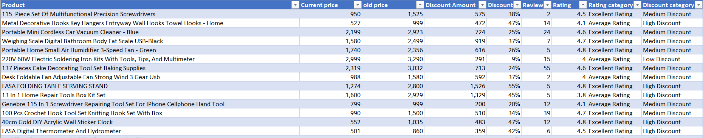
### Data Enrichment 
Create the following additional columns:  
• Discount Amount (KSh): Old Price minus Current Price 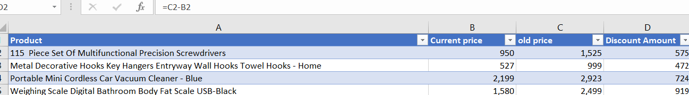 
• **Rating Category:**   
            Poor for ratings below 3  
            Average for ratings between 3 and 4.4  
            Excellent for ratings of 4.5 and above  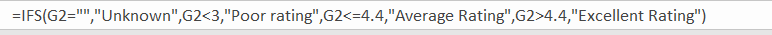
• **Discount Category:**   
             Low Discount for discounts below 20%  
             Medium Discount for discounts between 20% and 40%  
             High Discount for discounts above 40% 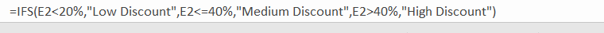
 
 
### Data Analysis 
#### Descriptive Analysis  
• What is the average current price, old price, discount percentage, and rating?  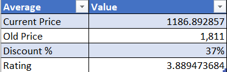  
• Which product is the most expensive and which is the least expensive?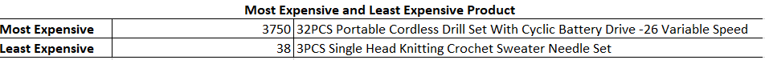  
• What is the average rating and discount by discount category?  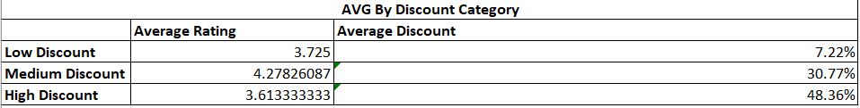 
• How are products distributed across rating categories? 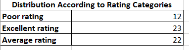
#### Trend and Relationship Analysis 
• Analyze the relationship between discount percentage and number of reviews 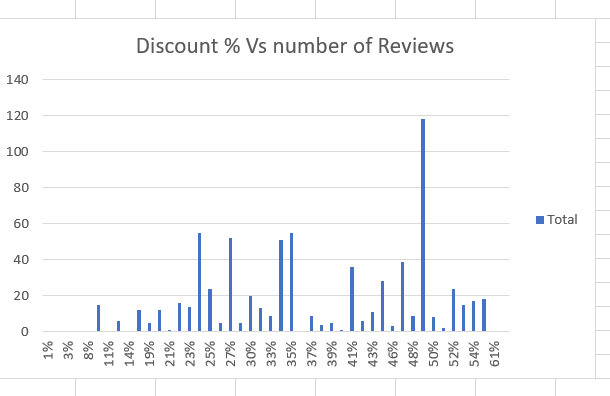
• Analyze the relationship between rating and number of reviews  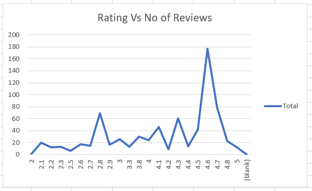
• Determine whether higher discounts lead to increased customer engagement 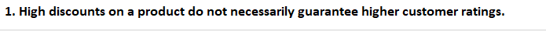 
• Determine whether higher-rated products tend to have more reviews  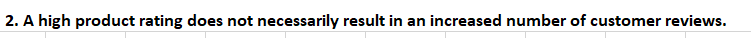
#### Product Performance Analysis 
• Identify the top 10 products with the highest discounts  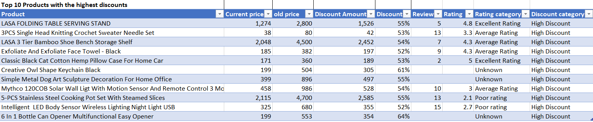
• Identify the top 10 products with the most reviews  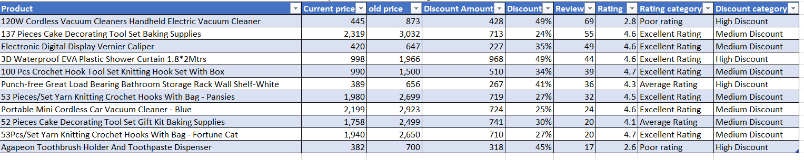 
• Identify the top 5 highest-rated and bottom 5 lowest-rated products  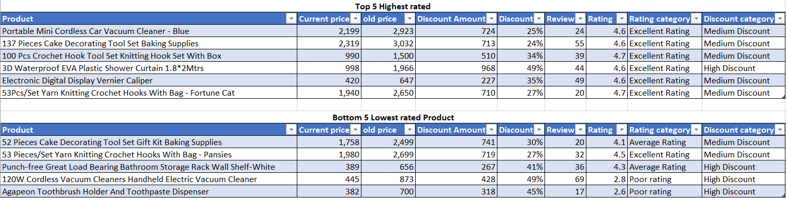
• Compare high-discount and low-discount products based on average rating and number of 
reviews   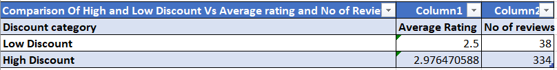
### Dashboard Design 
#### Dashboard Requirements 
Create a single interactive Excel dashboard containing the following sections: 
##### Overview 
• Total number of products  
• Average rating  
• Average discount percentage  
• Total number of reviews 
##### Product Performance 
• Top products by rating  
• Top products by number of reviews  
• Top products by discount percentage 
##### Trend Analysis 
• Visualizations showing discount percentage versus reviews  
• Visualizations showing rating versus reviews 
##### Product Categories 
• Breakdown of products by rating category  
• Breakdown of products by discount category 
##### Visualization Guidelines 
• Use Pivot Tables as the primary data source   
• Use appropriate charts such as bar charts, column charts, pie or donut charts, and scatter plots  
• Apply conditional formatting to highlight high discounts and low ratings 
• Include slicers for rating category, discount category, and price range where applicable
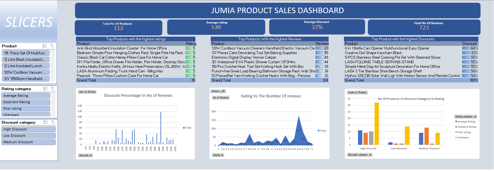